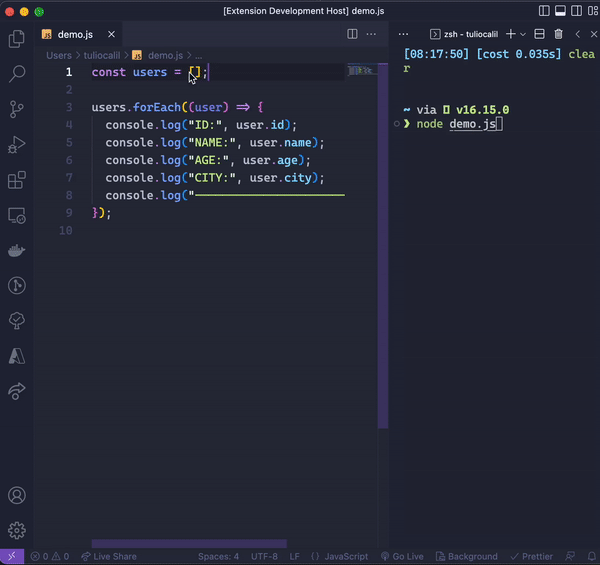

# JS Mock Data Generator

Generate mocks from your data structure in JSON format to speed up your tests and development!

## How to use

Open the command palette and type: `Generate Mock Data`.

> EG: `id:number,name:name,avatar:image,city

On the input and put the keys of the object that you want:

> You can type the keys using colon character .

### Types

| Type   | Description                        |
| ------ | ---------------------------------- |
| image  | Return a string with an image URL  |
| string | Return a paragraph                 |
| number | Return a random int                |
| name   | Return a string with a random name |

### TODO

- Improve validators
- Create new types
- Add more mocks

**Enjoy!**
